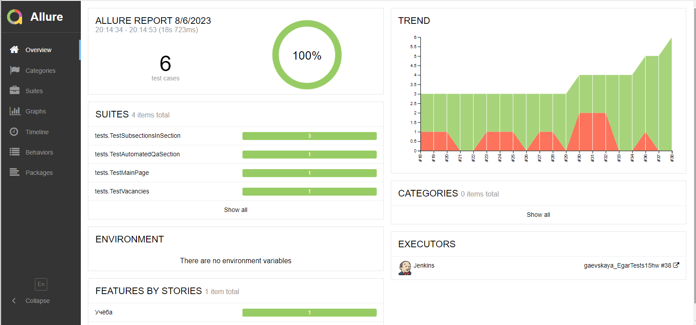
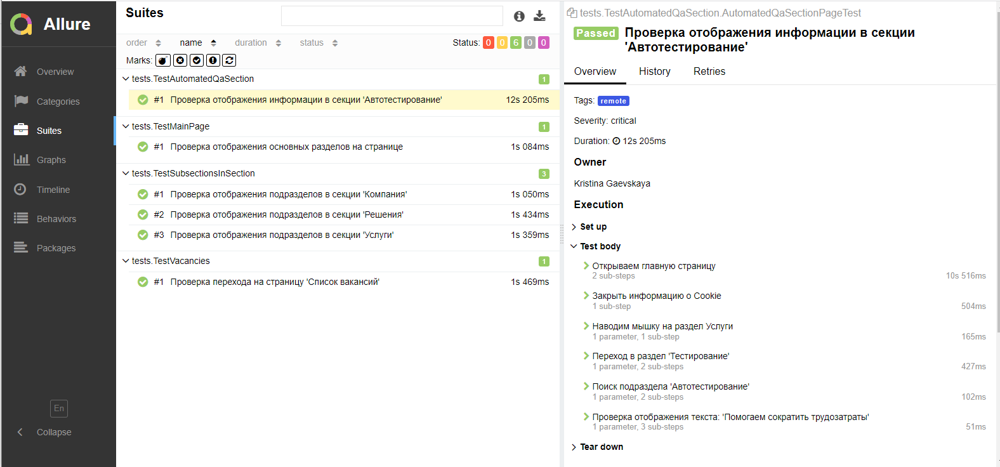
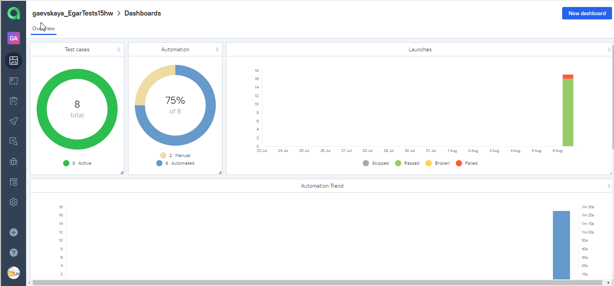
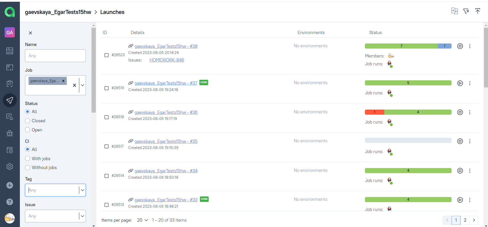
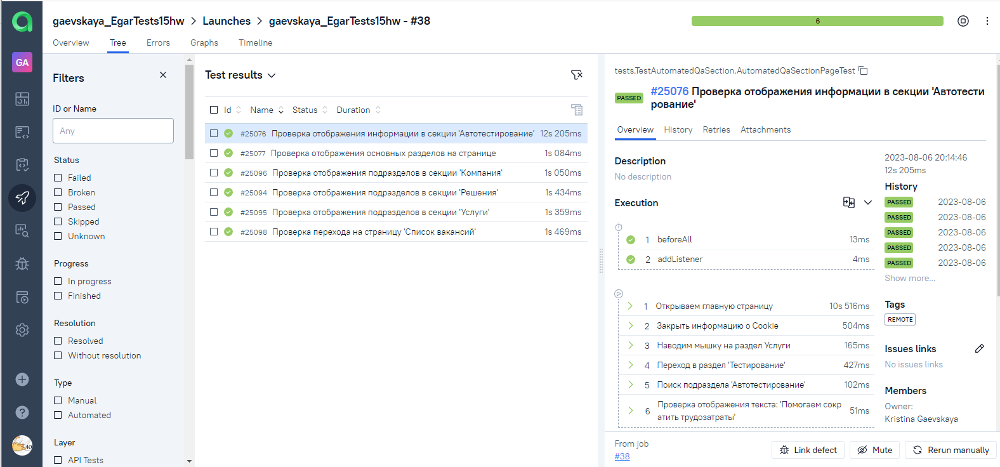
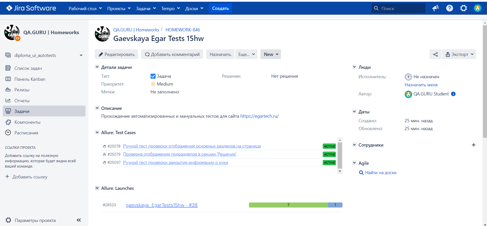
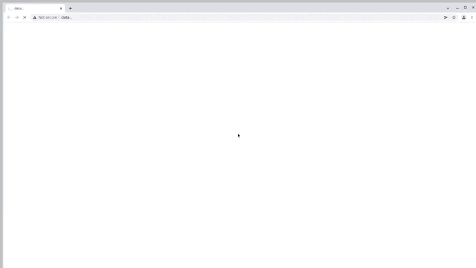

# Проект по автоматизации тестовых сценариев для сайта компании [EGAR Technology](https://egartech.ru/)
## :pushpin: Содержание:

- [Используемый стек](#computer-используемый-стек)
- [Запуск автотестов](#arrow_forward-запуск-автотестов)
- [Сборка в Jenkins](#-сборка-в-jenkins)
- [Пример Allure-отчета](#-пример-allure-отчета)
- [Интеграция с Allure TestOps](#-интеграция-с-allure-testops)
- [Интеграция с Jira](#-интеграция-с-jira)
- [Уведомления в Telegram](#-уведомления-в-telegram)
- [Видео пример запуска тестов](#-видео-пример-запуска-тестов)
## :computer: Используемый стек

<p align="center">
<a href="https://www.jetbrains.com/idea/">
<a href="https://www.java.com/">
<a href="https://selenide.org/">
<a href="https://aerokube.com/selenoid/">
<a href="https://github.com/allure-framework/allure2">
<a href="https://qameta.io/">
<a href="https://gradle.org/">
<a href="https://junit.org/junit5/">
<a href="https://github.com/">
<a href="https://www.jenkins.io/">
<a href="https://web.telegram.org/">
<a href="https://www.atlassian.com/ru/software/jira">
</p>

- Тесты в данном проекте написаны на языке <code>Java</code> с использованием фреймворка для тестирования [Selenide](https://selenide.org/)
- В качестве сборщика был использован - <code>Gradle</code>
- <code>JUnit 5</code> задействован в качестве фреймворка модульного тестирования
- При прогоне тестов браузер запускается в [Selenoid](https://aerokube.com/selenoid/)
- Для удаленного запуска реализована джоба в <code>Jenkins</code> с формированием Allure-отчета и отправкой результатов в <code>Telegram</code> при помощи бота
- Осуществлена интеграция с <code>Allure TestOps</code> и <code>Jira</code>

## :arrow_forward: Запуск автотестов

### Запуск тестов из терминала
```
gradle remote_test
```
При выполнении команды тесты запустятся удалённо.

Также можно переопределить параметры запуска:
```
gradle remote_test -DbaseUrl=${BASE_URL} -Dbrowser=${BROWSER} -DbrowserSize=${BROWSER_SIZE}
```


##  [Сборка в Jenkins](https://jenkins.autotests.cloud/job/gaevskaya_EgarTests15hw/)
### Параметры сборки
* <code>BASE_URL</code> – url, по которому будет открываться тестируемое приложение. По-умолчанию - <code>https://kontur.ru</code>.
* <code>BROWSER</code> – браузер и его версия. По-умолчанию - <code>chrome:100.0</code>.
* <code>BROWSER_SIZE</code> – размер окна браузера. По-умолчанию - <code>1920x1080</code>.

<p align="center">

</p>

##  [Пример Allure-отчета](https://jenkins.autotests.cloud/job/polina_rumak_kontur/9/allure/)
<p align="center">

</p>

### Результат выполнения теста
Содержание:
* Шаги теста
* Скриншот страницы на последнем шаге
* Page Source
* Логи браузерной консоли
* Видео прогона каждого автотеста

<p align="center">

</p>

##  [Интеграция с Allure TestOps](https://allure.autotests.cloud/project/2463/launches)
На вкладке Dashboards отображается:
- Количество тест-кейсов и их статус
- Соотношение ручных/автоматизированных тестов
- Результаты запусков/прохождения тестов в графике по датам
<p align="center">

</p>

На вкладке Launches можно увидеть:
- Результаты запусков автоматизированных тестов
- Результаты прохождения ручных тест-кейсов
<p align="center">

</p>

Результаты выполнения отдельных тестов:
* Шаги теста
* Скриншот страницы на последнем шаге
* Page Source
* Логи браузерной консоли
* Видео прогона автотестов

<p align="center">

</p>

##  [Интеграция с Jira](https://jira.autotests.cloud/browse/HOMEWORK-732)
Реализована интеграция <code>Allure TestOps</code> с <code>Jira</code>. В задаче отображаются прикреплённые к ней тест-кейсы, а также результаты запусков/прохождения тестов.
<p align="center">

</p>

###  Уведомления в Telegram
После завершения сборки, бот, созданный в <code>Telegram</code>, автоматически обрабатывает и отправляет сообщение с результатом.
<p align="center">

</p>

###  Видео пример запуска тестов
<p align="center">
  
</p>
